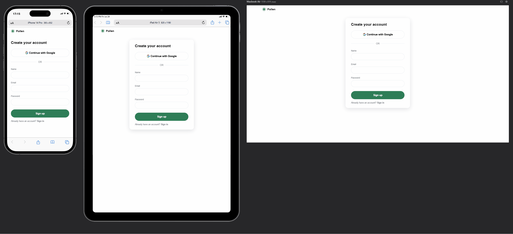

# Pollen

### Project

Web application where users get an hourly forecast of pollen data (pollen name and intensity) given a preferred location. It requires a quick signup before first use.

This app is non-commercial and expected to be used on a fair-use basis. To limit the workload on their servers, the Austrian Pollen Information Service, from which this app's data comes from, might cap daily calls to 40 requests. This might still serve this app's purpose: after all, pollen data might be checked sparingly as it doesn't mutate often.

### Built with

- RESTful API (Geocoding API, Polleninformation API)
- React 18 & Vite, React Router v6
- Zod
- Firebase & Realtime Database
- Semantic HTML5, Tailwind CSS
- Mobile-first workflow
- WCAG/ARIA compliant, keyboard navigable
- Cross-browser compatibility (Chrome, Edge, Safari, Firefox)

### Screenshot (live site: [pollen](https://tomduranti.github.io/pollen/))



### Code highlights
- separation of concerns for components and custom hooks: components manages UI, custom hooks API calls or data management.

- different signup/signin modes using Firebase auth
```
createUserWithEmailAndPassword(auth, credentials.email, credentials.password)
[...]
signInWithEmailAndPassword(auth, credentials.email, credentials.password)
[...]
signInWithRedirect(auth, GoogleProvider)
[...]
signInWithPopup(auth, GoogleProvider)
```
- Caching layer because of a rate-limited pollen API, with timestamp to check freshness of data (4h threshold) to avoid unnecessary calls

- Zod email and password validation
```
    .string()
    .min(1, 'Please enter an email')
    .email('Please enter a valid email address')
    .safeParse(emailToValidate)

    [...]

    .string()
    .min(6, 'The password must have at least 6 characters')
    .regex(/[A-Z]/, 'The password must have at least one uppercase character')
    .regex(/[a-z]/, 'The password must have at least one lowercase character')
    .regex(/[0-9]/, 'The password must have at least one number')
    .safeParse(passwordToValidate)
```

### Acknowledgements
Thanks to the Austrian Pollen Information Service (www.polleninformation) for providing the API for pollens and allergens.

## Changelog
All notable changes to this project will be documented in this file. The format is based on [Keep a Changelog](https://keepachangelog.com/en/1.1.0/), and this project adheres to [Semantic Versioning](https://semver.org/).

#### [v1.0.0] -- 27-07-2026

- User signup/signing with email or google account
- Save favourite location and fetch pollen data accordingly. Data is cached to reduce loading time and overridden if necessary
- Fully keyboard-navigable and screen-reader compliant (WCAG/ARIA)

## Roadmap

#### [v1.1.0] -- Unreleased

- dark mode

#### [v1.2.0] -- Unreleased

- language support for German (de), Finnish (fi), Swedish (sv), French (fr), Italian (it), Latvian (lv), Lithuanian (lt), Polish (pl), Portuguese (pt), Russian (ru), Slovak (sk), Spanish (es), Turkish (tr), Ukrainian (uk), and Hungarian (hu)
- personalized messages for users according to pollen severity

#### [v1.3.0] -- Unreleased

- Unit, integration and E2E tests

#### [v2.0.0] -- Unreleased

- NavBar contains avatar + user name. Group user functionalities like (signout, settings) in one menu. Substitute "Signout" button with theme switch icon 

- Reset password via email address
- User functionalities page to change language, upload profile picture, reset password

#### [v2.1.0] -- Unreleased

- Github and Apple signup/signin cycle